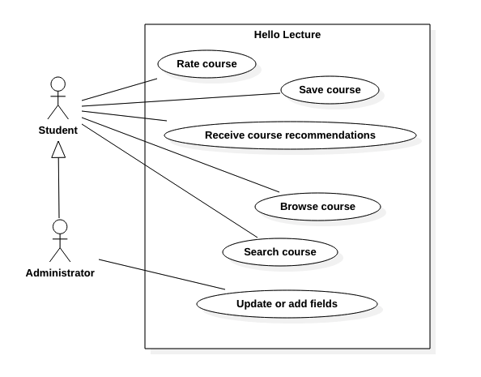

# HelloLecture
In this project I describe the software engineering process from a fictitious project.

## Project introduction
The software Hello Lecture is designed to help students to make the right course choice. For this purpose, information on the individual modules is to be provided, such as course contents, lecturer evaluation and the level of difficulty. Recommendations for further courses and reading should be suggested from the user data.

## Requirements
To classify software quality attributes I use the common used model with the acronym FURPS.

* **Functionality** (Capability, Reusability, Security)
  * The system must maintain a library of universities, departments, study programmes (e.g. mathematics, biology, ...) and courses
  * The system must allow users to browse and provide informations through the above mentioned areas
  * The system must allow users to give feedback on selected courses

* **Usability** (Human Factors, Aesthetics, Consistency, Documenation)
  * The system should be easy to control via touchdisplays

* **Reliability** (Availability, Failure Rate & Duration, Predictability)
  * The system should be available 24/7

* **Performance** (Speed, Efficiency, Resource Consuption, Scalability)
  * The system should be fast for slow smartphones

* **Supportability** (Testability, Extensibility, Serviceability, Configurability)
  * The system should be updatable
  
## Use Cases

  

### Browse Courses
* **Primary Actor:** Student

* **Success Scenario:** The student searches for his or her university and department. An overview of the available courses then appears.

### Search Course
* **Primary Actor:** Student

* **Success Scenario:** The student searches for a course name and gets a general (with other universities) or specific (university depending on profile) overview  of courses that match his/her search.

* **Extension:** If the searched course is not available, the user could add new data.

### Rate Course
* **Primary Actor:**: Student

* **Success Scenario:** The student selects a course and evaluates the individual categories for the course.

### Update fields (e.g. Universities, Courses, ...)
* **Primary Actor:**: Administrator

* **Success Scenario:** The administrator creates a new field and inserts relevant information

### Receive course recommendations
* **Primary Actor:** Student

* **Success Scenario:** Based on finished courses the system gives advices for next chapters.

* **Extension:** If there are no finished courses start with base courses.

### Save courses
* **Primary Actor:** Student

* **Success Scenario:** After the student selected at least one course as favourite, it appears on his/her personal page.

## Sources of information
* Software Engineering I & II at Beuth University of Applied Sciences
* LinkedIn Learning Course: Programming Foundations - Object-Oriented Design

## Software
* StarUML (free software for personal use, easy to use and included code generation tool)
